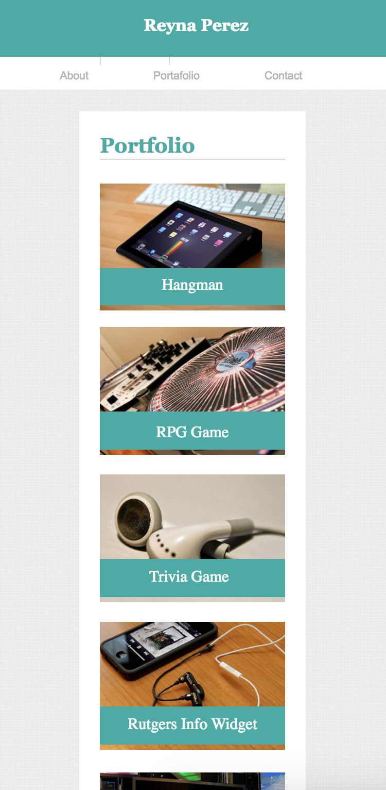

# Responsive-Portfolio

##Overview

*Responsive-Portfolio, make it responsive with css max-width:980px, max-width:768px, max-width:640px
for the different pages contact, index and portfolio

*980px

*768px

*640px

*980px

*768px

*640px

*980px

*768px

*640px

## Author

**Reyna Perez**

## Acknowledgments

*UA Programing Bootcamp